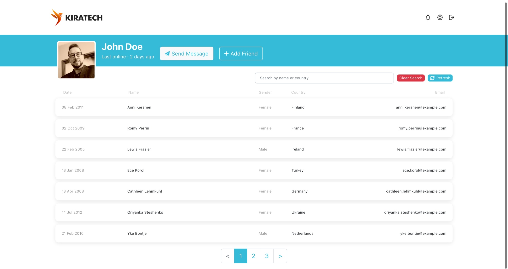

# Front End Assignment for Kiratech Assessment

This project was bootstrapped with [Create React App](https://github.com/facebook/create-react-app). Styling was using [Reactstrap](https://reactstrap.github.io/) components with slight customisation.

<u>The app has the following features:</u>
- Display a list of users fetched from the [Random User API](https://randomuser.me/api/?results=20).
- A refresh button that fetches the API again to generate a new random list of users.
- Modal pop up that displays user details if one of the user cards is clicked.
- Search feature that filters the results by `name` or `country`.
- Clear search feature that resets the search bar.
- Pagination to limit up to 7 users per page.

## Running the script
### 1. `npm install`
Installs all the dependencies required for running the app.
> If there are errors during installation, please check that you are using at least node version 14

### 2. `npm start`

Runs the app in the development mode.
Once installation is complete, you can run this command.
It opens [http://localhost:3000](http://localhost:3000) on your browser.